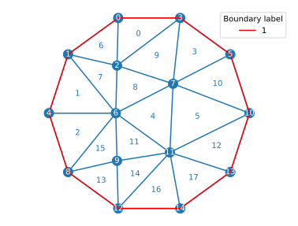

# pyFreeFem

pyFreeFem is a simple Python wrapper for the finite-element software [FreeFem++](https://freefem.org/). It helps [importing and exporting](./documentation/IO.md) meshes, finite-element matrices and vectors to and from FreeFem++. This library can only handle two-dimensional finite-element spaces.

Here is an example of its use:

[*Boltzmann Distribution of Sediment Transport*](http://dx.doi.org/10.1103/PhysRevLett.123.014501), A. Abramian, O. Devauchelle, G. Seizilles, E. Lajeunesse, Physical Review Letters, 123, 014501, 2019 [[arXiv]](https://arxiv.org/pdf/1907.01880)

## Quick example

Run FreeFem++ from Python:

```python
import pyFreeFem as pyff

script = pyff.edpScript( 'cout << "Hello world!" << endl;' )

print( script.run() )
```
```console
>>> Hello world!
```

## Create a mesh

FreeFem++ attributes labels to nodes, triangles and boundaries. pyFreeFem includes a mesh class inherited from matplotlib.Triangulation which keeps track of these labels.

```Python
script = pyff.edpScript('''
border Circle( t = 0, 2*pi ){ x = cos(t); y = sin(t); }
mesh Th = buildmesh( Circle(10) );
''')

script += pyff.OutputScript( Th = 'mesh' )

Th = script.get_output()['Th']

Th.plot_triangles( labels = 'index' )
Th.plot_nodes( labels = 'index', color = 'tab:blue' )
Th.plot_boundaries( color = 'red' )
pp.legend( title = 'Boundary label' )
pp.show()
```


Creating a mesh with FreeFem++ can be useful by itself, for instance to calculate [travel times](./documentation/travel_time.md) along known streamlines. Often, though, we want to use that mesh for finite elements computations.

## Documentation

More examples can be found in the [documentation](./documentation.md).

## To do

- Import mesh, vectors and matrices to FreeFem++ without writing in temporary file
