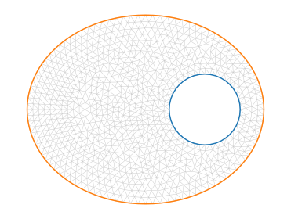
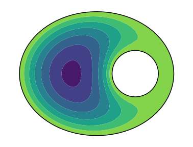
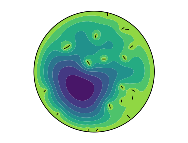

# pyFreeFem

pyFreeFem is a simple Python wrapper for the finite-element software [FreeFem++](https://freefem.org/). It helps importing and exporting meshes and finite-element matrices to and from FreeFem++. This library can only handle two-dimensional finite-element spaces.

Here is an example of its use:

[*Boltzmann Distribution of Sediment Transport*](http://dx.doi.org/10.1103/PhysRevLett.123.014501), A. Abramian, O. Devauchelle, G. Seizilles, E. Lajeunesse, Physical Review Letters, 123, 014501, 2019 [[arXiv]](https://arxiv.org/pdf/1907.01880)

## Quick example

Run FreeFem++ from Python:

```python
import pyFreeFem as pyff

script = pyff.edpScript( 'cout << "Hello world!" << endl;' )

print( script.run() )
```
```console
>>> Hello world!
```

## Create a mesh

FreeFem++ attributes labels to nodes, triangles and boundaries. pyFreeFem includes a mesh class inherited from matplotlib.Triangulation which keeps track of these labels.

```Python
script = pyff.edpScript('''
border Circle( t = 0, 2*pi ){ x = cos(t); y = sin(t); }
mesh Th = buildmesh( Circle(10) );
''')

script += pyff.edpOutput( data_type = 'mesh', name = 'Th' )

Th = script.get_output()['Th']

Th.plot_triangles( labels = 'index' )
Th.plot_nodes( labels = 'index', color = 'tab:blue' )
Th.plot_boundaries( color = 'red' )
pp.legend( title = 'Boundary label' )
pp.show()
```


## Finite element matrices

To get finite element matrices, we first need to create a mesh, and define a finite element space. The VarfBlock function then creates, and exports, the matrix corresponding to a variational formulation:

```python
import pyFreeFem as pyff

script = pyff.edpScript('''
border Circle( t = 0, 2*pi ){ x = cos(t); y = sin(t); }
mesh Th = buildmesh( Circle(20) );
fespace Vh( Th, P1 );
Vh u,v;
''' )

# Create and export stiffness matrix
script += pyff.VarfScript( stiffness = 'int2d(Th)( dx(u)*dx(v) +  dy(u)*dy(v) )')
stiffness = script.get_output()['stiffness']
print(stiffness)
```

```console
>>> (0, 0)	1.72789742056
>>> (0, 1)	-0.422931342447
>>> (0, 8)	-0.331359535237
>>> (0, 9)	-0.973606542874
...
```

## Solve a simple problem

We first create a mesh, and import the associated matrices.

```python
import pyFreeFem as pyff
import matplotlib.pyplot as pp

script = pyff.edpScript('''
real smallRadius = .3;
border outerCircle( t = 0, 2*pi ){ x = cos(t); y = 0.8*sin(t); }
border innerCircle( t = 2*pi, 0 ){ x = .5 + smallRadius*cos(t); y = smallRadius*sin(t); }
mesh Th = buildmesh( outerCircle(100) + innerCircle(40) );

fespace Vh( Th, P1 );
Vh u,v;
''')

script += pyff.edpOutput( data_type = 'mesh', name = 'Th' )

script += pyff.VarfScript(
    stiffness = 'int2d(Th)( dx(u)*dx(v) +  dy(u)*dy(v) )',
    Grammian = 'int2d(Th)( u*v )',
    boundary_Grammian = 'int1d(Th, 1, 2)( u*v )'
    )

ff_output = script.get_output()
Th = ff_output['Th']

Th.plot_triangles( color = 'k', alpha = .2, lw = .5 )
Th.plot_boundaries()
pp.show()
```
The mesh looks like this:



We now solve Poisson's equation on this mesh, with absorbing boundary conditions on the two boundaries. We do this with spsolve from the scipy library.

```python
from scipy.sparse.linalg import spsolve
import numpy as np

epsilon = 1e-4
M = - ff_output['stiffness'] + 1./epsilon*ff_output['boundary_Grammian']
Source = ff_output['Grammian']*np.array( [1]*len( Th.x ) )
u = spsolve( M, Source )

pp.tricontourf( Th, u )
Th.plot_boundaries( color = 'black' )
pp.show()
```
Here is the result:



## Mess with the mesh

We now create a mesh with FreeFem++, import it as a TriMesh, change its boundaries and export it back to FreeFem++.
```python
import pyFreeFem as pyff

# Create mesh with FreeFem++

script = pyff.edpScript( '''
border Circle( t = 0, 2*pi ){ x = cos(t); y = sin(t); }
mesh Th = buildmesh( Circle(150) );
''' )


script += pyff.edpOutput( data_type = 'mesh', name = 'Th' )

Th = script.get_output()['Th']


# Change mesh
for triangle_index in sample( range( len( Th.triangles ) ), 20 ) :
    Th.boundary_edges.update( { ( triangle_index, 0 ) : 2 } )

Th.rename_boundary( {1:'initial', 2:'new'} )
```
The mesh looks like this:


We want to solve the Poisson equation on this new mesh. Let us first calculate the finite-elements matrices we need.

```python
# Export mesh back to FreeFem

script = pyff.edpScript( pyff.edpInput( name = 'Th', source = Th ) )

# calculate FEM matrices

script +='''
fespace Vh( Th, P1 ) ;
Vh u, v ;
'''

matrices = {
    'stiffness' : 'int2d(Th)( dx(u)*dx(v) +  dy(u)*dy(v) )',
    'Grammian' : 'int2d(Th)( u*v )',
    'boundary_Grammian' : 'int1d(Th, 1, 2)( u*v )'
}

for matrix_name in matrices.keys() :
    script += pyff.VarfBlock( name = matrix_name, varf = matrices[matrix_name] )

matrices = script.get_output()
```
We may now solve our finite-element problem as [above](#solve-a-simple-problem). Here is the result:



A more useful mesh change, perhaps, is to [refine it](./documentation/adaptmesh.md).

## To do

- Import mesh, vectors and matrices to FreeFem++ without writing in temporary file
- Import and export real numbers and integers
