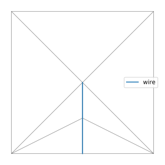
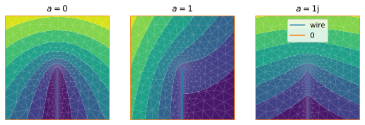
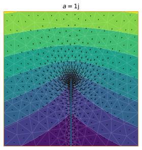
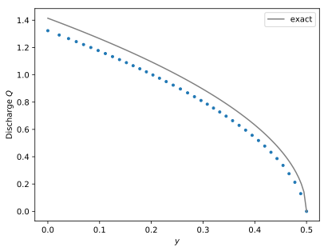

# Discharge through a wire

We want to calculate the discharge of some field through a wire, that is, a boundary that ends in the domain over which the field is defined. To do this, we will create a mesh with a needle boundary, and define an analytical field around the needle. This will be our test case.

## Initial mesh

We begin with a straight needle in a square box:

```python
from pylab import *
import pyFreeFem as pyff

box_points = [ [ .5, 0 ], [.5,1], [-.5,1], [-.5,0] ]

y_wire = linspace(0,.5,3)

wire_points = list( array( [ y_wire*0, y_wire ] ).T )
# wire_points = wire_points[::-1][1:] + wire_points


Th = pyff.TriMesh( *array( box_points + wire_points ).T )
Th.add_boundary_edges( range( len( box_points ), len( box_points ) + len( wire_points ) ) , 'wire' )
```

Here's how the mesh looks like:

```python
Th.plot_triangles( lw = .7, color = 'grey' )
Th.plot_boundaries()
legend()
```


## Field

Let us define a field $v$ around this needle. For instance:

$$ v = \mathrm{Re} \left( \sqrt{ -i ( z - z_{\mathrm{tip}} ) } + a z \right)  $$

where $z$ is the complex coordinate $x+iy$.

```python
def field( Th, a = 0 ) :
    z = Th.x + 1j*Th.y
    return real( sqrt( -1j*( z - 1j*y_wire[-1] ) ) - a*z )
```

We then need to refine the mesh based on this expression:

```python
for _ in range(5) :

    try :
        Th = pyff.adaptmesh( Th, v, iso = 1 )
    except :
        pass

    v = field( Th )
```

Here is the result:

```python

a_list = [0, 1, 1j]

fig_v, axs = subplots( ncols = len( a_list ), figsize = array( [ len( a_list ), 1.1 ] )*3 )

for i, a in enumerate(a_list) :
    ax_mesh = axs[i]
    ax_mesh.set_title( r'$a=$' + str(a) )

    ax_mesh.tricontourf( Th, field( Th, a ) )
    Th.plot_triangles( ax = ax_mesh, lw = .7, color = 'w', alpha = .2 )
    Th.plot_boundaries( ax = ax_mesh )
```



## Discharge through the wire

The discharge $Q$ at each point along the needle is

$$
Q(s) = \int_{ \sigma < s} \left[ \partial_n v \right] \mathrm{d} \sigma
$$

where $s$ is the arclength coordinate along the needle ($s=0$ at the tip), and the brackets stand for the jump across the needle. In our case,

$$
Q(s) = 2\sqrt{s}
$$

regardless of the constant $a$. Indeed, we can add any field that's continuous across the needle without changing the discharge $Q$. In particular, the total discharge through the needle is

$$
Q_{\mathrm{total}} = 2 \sqrt{l} \approx 1.41
$$

 ### Failure of `int1d`

The natural way to compute the discharge through a boundary with FreeFem++ is to use the function `int1d`:

```python
name_to_index, index_to_name = Th.get_boundary_label_conversion()

script = pyff.InputScript( Th = Th )
script += 'fespace Vh(Th,P1);'
script += pyff.InputScript( v = 'vector' )
script += 'real Q = int1d( Th,' + str( name_to_index['wire'] ) + ' )( N.x*dx(v) + N.y*dy(v) );'
script += pyff.OutputScript( Q = 'real' )

for i, a in enumerate(a_list) :
    print( 'a=', a, script.get_output( v = field( Th, a ) ) )
```

```console
a= 0 {'Q': -0.66447}
a= 1 {'Q': -0.436683}
a= 1j {'Q': -0.66447}
```

In the above values for $Q$, the sign is only a matter of convention. The problem is that this value changes when $a$ is a finite real number, that is, when the field is not symmetric with respect to the needle.

The first and last values (when the field is symmetric), are about half the correct value.

The reason for this discrepancy is that the instruction `int1d` sums the contribution to the flux through one side of the needle only. Indeed, since edges and triangles are oriented, there is only one triangle that includes a given edge along the needle.

We thus need to build the matrix associated to the flux by hand.

### Gradient

To compute the discharge, we first need to calculate the flux, that is, the gradient of the field:

```python
matrices = pyff.gradient_matrices( Th )

dxv = matrices['grad_x']*v
dyv = matrices['grad_y']*v
```

If the field is defined on a P1 space (one value per node), its gradient will live in a P0 space (one value per triangle):

```python
print( 'v', len(Th.x), len(v) )
print( 'dxv', len(Th.triangles), len(dxv) )
```

```console
v 424 424
dxv 806 806
```

This is how the gradient field looks like:

```python
X = []

for i, triangle in enumerate( Th.triangles ) :
    X += [ [ mean( Th.x[triangle] ), mean( Th.y[triangle] ) ]  ]

quiver( *array(X).T, -dxv, -dyv )
```



### Flux matrix

To compute the discharge along the needle, we need to integrate the gradient along both sides of the needle. To do that, we first calculate, for each edge, the sum of the contributions of the two triangles that contain it (one triangle for each orientation of the edge). The pyFreeFem function `flux_along_needle` does just this.

```python
boundary_nodes = Th.get_boundaries()['wire'][0] # This is dangerous, as ordering can be messed up. We should keep track of the wire independently from Th.
boundary_nodes = boundary_nodes[::-1] # start from tip

q_mat = pyff.flux_along_needle( Th, boundary_nodes )

print( shape(q_mat) )
```

```console
(424, 424)
```
The matrix `q_mat` maps a P1 field onto another P1 field, which vanishes everywhere but along the wire, where it represents $q\mathrm{d}s$ (width $q=[\partial_n v]$).

We can compare the result to the theoretical value:

```python
ms = 15

for a in a_list:
    qds = q_mat.dot( field( Th, a ) )
    q = -qds[boundary_nodes][1:]/diff(y)

    ax_q.plot( y[1:], q, '.', ms = ms, label = str(a) )
    ms *= .7

y_th = linspace( 0 , .5, 100 )
ax_q.plot( y_th, 1/sqrt( .5 - y_th ), color = 'grey', zorder = -1, label = 'exact' )
```


At the tip ($y=0.5$), $q\mathrm{d}s$ is zero by convention. This will allow us to sum the flux to get the discharge.

### Discharge matrix

One way to calculate the discharge $Q$ along the wire is simply to sum the values of $q$:

```python
print('Q=', sum(qds) )
```

```console
Q= 1.3229621400780547
```

This is close to the theoretical value, and gets much better when we increase the number of mesh adaptations (with `adaptmesh`).

If the discharge is [part of the problem](./wire.md), however, we need to create a discharge matrix, which we can include in a finite-element problem. This is done with the function `needle_discharge`:

```python
Q_mat = pyff.needle_discharge( Th, boundary_nodes )
```

We can then check the result:

```python
plot( y, Q_mat.dot( field( Th, 0 ) )[boundary_nodes], '.')
plot( y_th, 2*sqrt(y_th[-1] - y_th), color = 'grey', label = 'exact' )
```


Again, this result improves when we refine the mesh. As it should, it is insensitive to the value of $a$.
