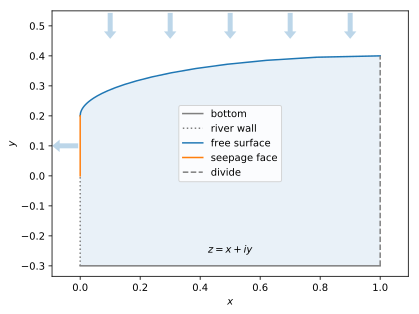

# Flow in a free-surface aquifer

We want to compute the two-dimensional Darcy flow in an unconfined aquifer. The problem features a free boundary, where both the pressure and the stream function are known, but the location of which is unknown a priori.

A laboratory example of such a flow can be found here:

[Flow and residence time in a two-dimensional aquifer recharged by rainfall](https://hal.archives-ouvertes.fr/hal-03207646/document), V. Jules, E. Lajeunesse, O. Devauchelle, A. Guérin, C. Jaupart, P.-Y. Lagrée, *Journal of Fluid Mechanics*, 917, A13, 2021.

A similar problem is presented in the [FreeFem++ documentation](https://doc.freefem.org/models/free-boundary-problems.html), where a time-dependent Darcy flow with a free surface is solved. This time-evolution numerical scheme, however, gets unstable as it approaches the steady state.

We propose here an alternative based on conformal mapping. A preliminary version of this method can be found here:

[Flow in a thick and unconfined aquifer recharged by rainfall](https://u-paris.fr/theses/detail-dune-these/?id_these=4682) (in French), V. Jules,
*Thèse de doctorat en Sciences de la terre et de l'environnement*,
ED 560 Sciences de la terre et de l'environnement et physique de l'univers, Université Paris Cité, Paris, 2020.

## Equations and boundary conditions

We want to solve the Laplace equation for the pressure head $\phi$ in a two-dimensional aquifer, that is:

$$
\nabla^2 \phi = 0
$$

under the water table. We define the analytical function $\Phi=\phi + i \psi$, where $\psi$ is the stream function associated to this Darcy flow.

The boundary conditions are:

- On the bottom, $y = -H$ and $\psi=0$
- On the divide, $x = 1$ and $\psi=0$
- On the river wall (below the river, $y<0$), $x=0$ and $\psi=0$
- On the seepage face (above the river, $y>0$), $x=0$ and $\phi=y$
- On the free surface (the water table), $\phi = y$ and $\psi = R( 1 - x )$

where $R$ is the recharge (rainfall) rate.

