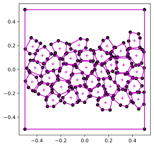
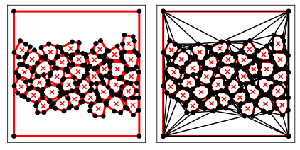
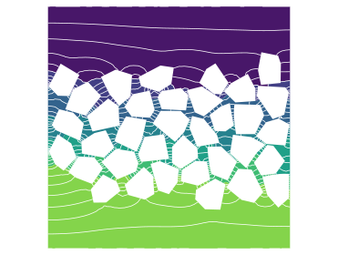
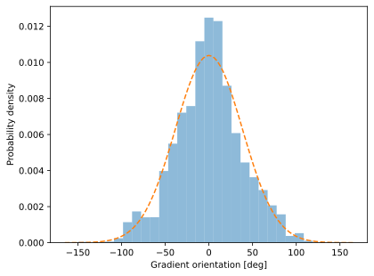

# Diffusion through a pack of grains

We want to evaluate how a pack of impervious grains affects the direction of a diffusion flow. This problem is inspired by the work of A.P. Petroff:

Petroff, A., Rosselli-Calderon, A., Roque, B., & Kumar, P. (2022). [Phases of active matter composed of multicellular magnetotactic bacteria near a hard surface](https://doi.org/10.1103/PhysRevFluids.7.053102). *Physical Review Fluids*, **7**(5), 053102.

The complete code is [here](../examples/grains/mesh_grains.py).

## Imports

```python
rom pylab import *
import triangle as tr
import json as json
from scipy.sparse.linalg import spsolve
from shapely import wkt as shp_wkt
import pyFreeFem as pyff
```

## Load the grains

The json file [`grains.json`](../examples/grains/grains.json) contains the geometry of the grain pack. It was produced with the [GrainPacking](https://github.com/odevauchelle/GrainPacking/tree/main) library. The code is [here](https://github.com/odevauchelle/GrainPacking/blob/main/examples/bugs_in_mud.py).

```python
with open('grains.json') as the_file :
    boundaries = json.load(the_file)
```

## Build the triangulation

We now build a triangulation around the grains, using the [triangles](https://rufat.be/triangle/index.html) library, as illustrated [here](https://github.com/odevauchelle/pyFreeFem/blob/master/documentation/triangle.md). To do so, we will need to fill the following dictionary:

```python
Ts = { 'segments' : [], 'vertices' : [], 'segment_markers' : [], 'holes' :[] }
```

First, the box that contains the grains:

```python
for interior in shp_wkt.loads( boundaries['box'] ).interiors : # there is only one interior

    for point in interior.coords[:-1] :

        Ts['vertices'] += [ point ]

        try :
            vertex_index += 1
        except :
            vertex_index = 0

        if vertex_index > 0 :
            Ts['segments'] += [ [ vertex_index - 1, vertex_index ] ]

    Ts['segments'] += [ [ vertex_index, 0 ] ]

Ts['segment_markers'] = ( -arange( 1, 5 ) ).tolist()
```

Then, the grains themselves:

```python
shrink_factor = .97

for grain in boundaries['grains'] :

    points = []

    grain = shp_wkt.loads( grain )
    center = grain.centroid
    Ts['holes'] += [ [center.x, center.y] ]

    for point in grain.exterior.coords[:-1] :

        point = center.x + shrink_factor*( point[0] - center.x ), center.y + shrink_factor*( point[1] - center.y )

        points += [ point ]
        vertex_index += 1

        if len(points) > 1 :
            Ts['segments'] += [ [ vertex_index - 1, vertex_index ] ]
            Ts['segment_markers'] += [ -5 ]

    Ts['segments'] += [ [ vertex_index, vertex_index - len(points) + 1 ] ]
    Ts['segment_markers'] += [ -5 ]

    Ts['vertices'] += points
```

The `shrink_factor` is here to prevent the packed grains from overlapping each other. We can now look at the geometry of our problem:

```python
ax_grains = gca()

for vertex in Ts['vertices'] :
    ax_grains.plot(*vertex, 'ko')

for hole in Ts['holes'] :
    ax_grains.plot(*hole, '+m')

for segment in Ts['segments'] :
    ax_grains.plot( *array(Ts['vertices'])[segment].T, color = 'm'  )
```



Were are now ready to build the triangulation.

```python
T = tr.triangulate( Ts, 'pa' )
tr.compare( plt, Ts, T )
```



The triangulation is rough; we will refine it later.

## Finite-elements mesh

We now import the triangulation in pyFreeFem, rename the boundaries for clarity, and refine the mesh.

```python
Th = pyff.triangle_to_TriMesh( T )
Th.rename_boundary( { -1 :'bottom', -2:'side', -3:'top', -4:'side', -5:'grain' } )

boundary_number, boundary_name = Th.get_boundary_label_conversion()

Th = pyff.adaptmesh( Th, hmax = .1 )
```

## Finite-elements matrices

We define two finite-elements spaces on the mesh. The main one is second-order (P2); we will use it to solve the concentration field. The second one is zeroth-order (P0, one data point per triangle); we will use id to compute the probability distribution of the diffusion-flux orientation.

```python
script = pyff.InputScript( Th = 'mesh' )

script += '''
fespace Vh( Th, P2 );
Vh u,v;
Vh X = x, Y = y;

fespace VhDiff( Th, P0 );
'''
```

We then need to define the finite-element matrices we'll need to solve the problem. They correspond to the P2 space:

```python
script += pyff.VarfScript(
    stiffness = 'int2d(Th)( dx(u)*dx(v) +  dy(u)*dy(v) )',
    top = 'int1d(Th,' + str( boundary_number['top'] ) + ')( u*v )',
    bottom = 'int1d(Th,' + str( boundary_number['bottom'] ) + ')( u*v )',
    dx = 'int2d(Th)( dx(u)*v )',
    dy = 'int2d(Th)( dy(u)*v )',
    )
```

We will also need two matrices to compute the flux, after the problem is solved; they mix the two spaces.

```python
script += pyff.VarfScript(
    gramian = 'int2d(Th)( du*v )',
    functions = ('du','v'),
    fespaces = ('VhDiff', 'Vh')
    )
```

Finally, we export the position vectors:

```python
script += pyff.OutputScript( X = 'vector', Y = 'vector' )
```

## Solution

We are now ready to solve the problem. We do so three times, and refine the mesh twice for better precision.

```python
epsilon = 1e-6

for _ in range(3) :

    try :
        Th = pyff.adaptmesh( Th, c, hmin = 0.02 )
    except :
        pass

    FE_matrices = script.get_output( Th = Th )
    M = FE_matrices['stiffness'] - 1/epsilon*( FE_matrices['top'] + FE_matrices['bottom'] )
    B = FE_matrices['top']@( FE_matrices['X']*0 + 1 )
    c = spsolve( M, B )
```

To plot the result, we first need to project it onto a P1 space (one data point per vertex):

```python
p = pyff.get_projector( Th, 'P2', 'P1' )

ax_c = gca()
ax_c.tricontourf( Th, p@c )
contours = ax_c.tricontour( Th, p@c, colors = 'w', linestyles = '-', linewidths = .75, levels = 50 )
```



## Flow direction

We now compute the gradient of the contentration field on the P0 space, and collect the centroid and area of each triangle.

```python
gradient = spsolve( FE_matrices['gramian'].T@FE_matrices['gramian'], FE_matrices['gramian'].T@FE_matrices['dx']@c ), spsolve(FE_matrices['gramian'].T@ FE_matrices['gramian'], FE_matrices['gramian'].T@FE_matrices['dy']@c )

Xt = [] # centroids of triangles
At = [] # areas of triangles

for tr in Th.triangles :
    X_local = array( [ Th.x[tr], Th.y[tr] ] ).T
    Xt += [ mean(X_local, axis = 0) ]
    At += [ cross( X_local[1] - X_local[0], X_local[2] - X_local[0] )/2 ]
```

For a sanity check:

```python
ax_c.quiver( *array(Xt).T, *gradient, color = 'w'  )
```

More interestingly, we can compute the distribution of flow direction, weighted by the area of each triangle. We only consider the triangles that are surrounded by grains ($|y|<0.15$).

```python
ax_h = gca()
selection = abs( array( Xt )[:,1] ) < .15
a = angle( 1j*gradient[0] - gradient[1] )[ selection ]*180/pi
weights = array(At)[ selection ]
ax_h.hist( a, weights = weights, alpha = .5, bins = 150*linspace(-1,1,30), density = True )
```



The result ressemble a Gaussian distribution with standard deviation $\sigma = 38^{\circ}$. This value is essentially unaffected by the pore size (`shrink_factor` parameter), nor by the specific disposition of the grains.
