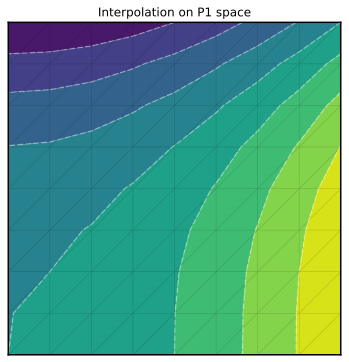

# Mixed finite-element spaces

On a given mesh, FreeFem++ can define a variety of finite elements (e.g. P1, P2). Here we show how to switch from one to the other with pyFreeFem.

## Build a projector from scratch

We first build a square mesh for illustration, and create two distinct finite-element spaces on it:
```python
from pylab import *
from scipy.sparse.linalg import spsolve
import pyFreeFem as pyff

script = pyff.edpScript('mesh Th = square( 8, 8 );')
script += pyff.OutputScript( Th = 'mesh' )
script += '''
fespace Vh1( Th, P1 );
fespace Vh2( Th, P2 );
'''
```
To create the projector from Vh2 to Vh1, we need two Gramian matrices:
```python
script += pyff.VarfScript(
    Gramian1 = 'int2d(Th)( v*u )',
    fespaces = ( 'Vh1', 'Vh1' )
    )

script += pyff.VarfScript(
    Gramian2 = 'int2d(Th)( v*u )',
    fespaces = ( 'Vh2', 'Vh1' )
    )
```
Finally, we create a vector u2 that belongs to the Vh2 space, and output all these quatities:
```python
script += 'Vh2 u2 = x^2 - y^3;'

script += pyff.OutputScript( u2 = 'vector' )

output = script.get_output()

Th = output['Th']
G = None, output['Gramian1'], output['Gramian2']
u2 = output['u2']
```
The projector then reads
```python
proj = spsolve( G[1], G[2] )
```
and we can check its dimensions:
```python
print( shape(proj) )
print( len( Th.x ) )
print( len( u2 ) )
```
```console
>>> (81, 289)
>>> 81
>>> 289
```
We can now project u2 on its P1 counterpart, u1:
```python
u1 = proj*u2
```
The result looks like this (dashed white lines show `Th.x**2 - Th.y**3`):


## Projection and interpolation

In fact, the above procedure is encapsulated into the `get_projector` fucntion of pyFreeFem:
```python
proj = pyff.get_projector( Th, 'P2', 'P1' )
```
We would like to compare the result of a projection to that of an interpolation, as FreeFem++ does it when we write:
```c++
Vh1 u1 = u2;
```
Again, the pyFreeFem function `interpolate` does just that:
```python
u1_ff = pyff.interpolate( Th, u2, 'P2', 'P1' )
```
The result looks like this (dashed white lines show `Th.x**2 - Th.y**3`):


