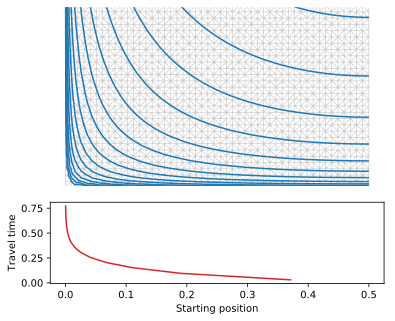
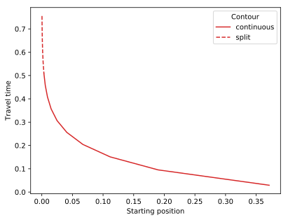

# Travel time along a streamline

Here we calculate numerically the travel time along analytic streamlines past a corner. The streamlines correspond to the complex hyperbolic cosine.

## Naive method

We first build a regular, rectangular mesh on which we evaluate the streamlines:

```python
from pylab import *
import matplotlib.tri as tri

################# PARAMETERS
L = 1.
H = .3
k = pi/L
levels = logspace( -3, 0, 15 )

def Phi(z) :
    return -cosh( k*( 1j*z - H ) )

################ MESH
x = linspace( 0, L/2., 50 )
y = linspace( -H, 0, int( len(x)/max(x)*H ) )
x, y = meshgrid( x, y )
x = x.flatten(); y = y.flatten()
z = x + 1j*y

Th = tri.Triangulation( x, y )
```
We then extract the contours of the stream function, and plot them at the same time:
```python
contours = ax.tricontour( Th, imag( Phi(z) ), levels = levels )
```
The mesh looks like this:



The problem, of course, is the singularity at the lower left corner. Notwithstanding, we calculate the travel time for each contour:
```python
x_start = []
t = []

for contour in contours.collections:
    for path in contour.get_paths() :
        x, y = path.vertices.T
        z = x + 1j*y
        phi = real( Phi(z) )
        ds = sqrt( diff(x)**2 + diff(y)**2 )
        dt = ds**2/diff(phi)
        x_start += [ x[0] ]
        t += [ sum(dt) ]
```
As expected, the travel time diverges near the singularity; it is a stagnation point.

## Take the stagnation point off

We now use pyFreeFem to build a mesh that skirts the stagnation point:
```python
script = pyff.InputScript( L = L, H = H, epsilon = epsilon, npts = npts )
script +='''
border top( t = L/2., 0 ){ x = t; y = 0; }
border left( t = 0, -(H -epsilon) ){ x = 0; y = t; }
border skirt( t = pi/2, 0 ){ x = epsilon*cos(t); y = -H + epsilon*sin(t); }
border bottom( t = epsilon, L/2. ){x = t; y = -H; }
border right( t = -H, 0 ){ x = L/2; y = t; }
mesh Th = buildmesh( top(npts) + left(npts) + skirt(npts) + bottom(npts) + right(npts) );
'''
script += pyff.OutputScript( Th = 'mesh' )

Th = script.get_output()['Th']
z = Th.x + 1j*Th.y
```
Here is the mesh:


Some contours now cut through the boundary that skirts the stagnation point. To compute their travel time, we need to stitch their segments together, and add the travel time through the singularity's neighborhood.

We first define the function that gives the travel time near the stagnation point :
```python
def skirt_time( z, Phi ) :
    A = real( Phi/z**2 )
    psi = imag(Phi)
    phi_in = real(Phi)
    phi_out = real( -conj( Phi ) ) # symmetry
    return ( arcsinh( phi_out/psi ) - arcsinh( phi_in/psi ) )/( 4*A )
```
We may now call this function when computing the travel time of split contours:
```python
z_sp = -1j*H # stagnation point

x_start = []
t = []

for contour in contours.collections:

    travel_time_path = 0
    x_start_path = []

    for path in contour.get_paths() :
        x, y = path.vertices.T
        z = x + 1j*y
        phi = real( Phi(z) )
        ds = sqrt( diff(x)**2 + diff(y)**2 )
        dt = ds**2/diff(phi)
        travel_time_path += sum(dt)
        x_start_path += [ x[0] ]

        if ( abs( z[-1] - z_sp ) - epsilon ) < epsilon :
            travel_time_path += skirt_time( z[-1] - z_sp, Phi( z[-1] ) - Phi( z_sp ) )

    x_start += [ x_start_path[0] ]
    t += [ travel_time_path ]
```
Here is the result:



## Many modes
